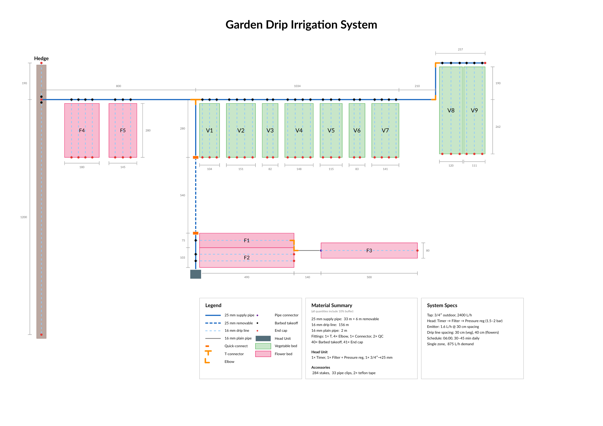

# Garden Drip Irrigation System

Single-zone drip irrigation system for a garden with 9 vegetable beds, 5 flower beds, and a hedge.

## Layout



## System Overview

| Parameter | Value |
|-----------|-------|
| Water source | 3/4" outdoor tap, 2400 L/h |
| System demand | ~875 L/h |
| Zones | 1 (full system runs at once) |
| Head unit | Timer → Filter → Pressure reg (1.5-2 bar) |
| Emitters | 1.6 L/h @ 30 cm spacing |
| Drip line spacing | 30 cm (veg), 40 cm (flowers) |
| Schedule | 06:00, 30-45 min daily |

## Beds

| Zone | Beds | Drip lines |
|------|------|------------|
| Upper vegetables | V1-V7 (280 cm deep) | 22 lines |
| Top-right vegetables | V8-V9 (452 cm deep) | 6 lines |
| Flowers (near tap) | F1, F2, F3 | 4 lines |
| Flowers (near hedge) | F4, F5 (280 cm deep) | 7 lines |
| Hedge | 1 line (190 cm up + 1200 cm down) | 1 line |

## Materials Summary (10% buffer included)

| Item | Quantity |
|------|----------|
| 25 mm supply pipe | ~33 m + 6 m removable |
| 16 mm drip line | ~156 m |
| 16 mm plain pipe | ~2 m |
| T-connector 25 mm | 1 |
| Elbow 25 mm | 2 |
| Elbow 16 mm | 2 |
| Connector 16 mm | 1 |
| Quick-connect 25 mm | 2 |
| Barbed takeoffs | 40 |
| End caps | 41 |
| Stakes | ~284 |
| Pipe clips | ~33 |

See [irrigation_materials_list.md](irrigation_materials_list.md) for the full breakdown.

## Build the diagram

Requires [Typst](https://typst.app/) with the `cetz` package and Lato font.

```sh
typst compile garden-layout.typ
```

Output: `garden-layout.pdf` (A4 landscape, single page)

## Files

| File | Description |
|------|-------------|
| `garden-layout.typ` | Typst source for the layout diagram |
| `garden-layout.pdf` | Compiled diagram |
| `irrigation_materials_list.md` | Complete materials list with per-zone breakdown |
